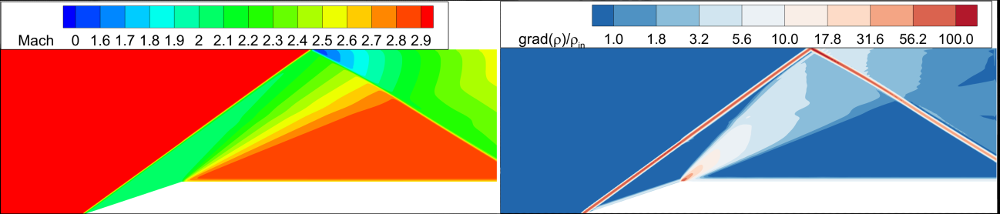
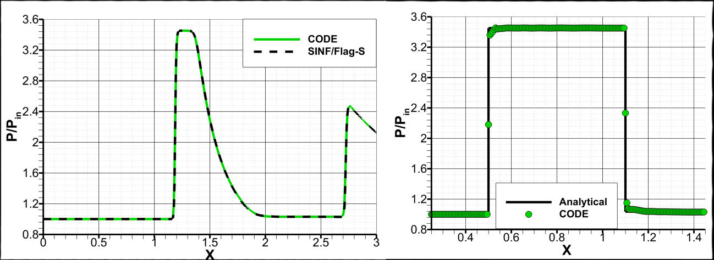
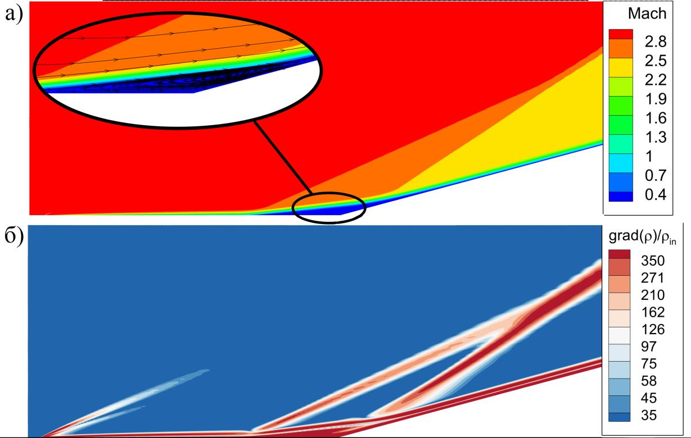
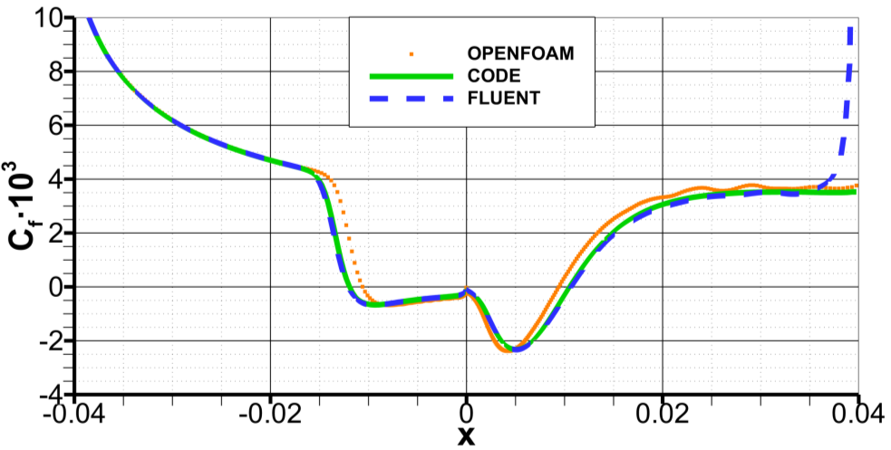

# CFD-Solver

A finite-volume solver for **compressible gas flows**, with a focus on **efficient implicit and matrix-free methods** on unstructured grids.

> Density-based, cell-centered finite-volume code for the compressible Euler and Navier–Stokes equations, in **2-D and 3-D**. Developed as part of a bachelor's thesis at Peter the Great St. Petersburg Polytechnic University (SPbPU) and verified against the in-house code SINF/Flag-S, OpenFOAM, and Ansys Fluent.

`Fortran 2008` · `CMake ≥ 3.15` · `License: MIT`

## Overview

CFDSolver computes steady compressible flows — subsonic through supersonic, inviscid (Euler) and viscous (Navier–Stokes) — using the finite-volume method on general unstructured grids. The code is **parameterized by spatial dimension and runs in both 2-D and 3-D**.

The emphasis of the project is the **implicit solver**: alongside a classical implicit scheme, it implements two **matrix-free** formulations (Jacobian-Free Newton–Krylov and an algorithmic-differentiation scheme) that avoid forming and storing the global Jacobian, reducing memory use and, in many cases, accelerating convergence.

## Features

**Governing equations**
- Compressible Euler and Navier–Stokes equations (integral / finite-volume form), 2-D and 3-D
- Perfect-gas equation of state; Sutherland's law for viscosity; Fourier heat conduction at constant Prandtl number

**Spatial discretization (unstructured)**
- General unstructured grids of arbitrary cell topology (Ansys Fluent `.cas` / `.msh` format)
- Convective flux schemes: **Roe, HLL, HLLC, AUSM, AUSM+**
- Spatial accuracy: 1st order; 2nd-order MUSCL + TVD (MinMod, Van Leer, Van Albada, Superbee limiters); 3rd-order WENO
- Viscous fluxes: 2nd-order with non-orthogonality correction
- Gradient reconstruction: Green–Gauss or Least-Squares

**Time integration to steady state** (pseudo-time marching, local time stepping via CFL)
- Explicit
- Classical implicit (approximate analytical Jacobian / stabilizing operator)
- **Jacobian-Free Newton–Krylov** (matrix-free, finite-difference matrix–vector products)
- **Algorithmic Differentiation** (matrix-free; flux differentiated with TAPENADE for machine-precision matrix–vector products)
- **Block LU-SGS (BLUSGS)**
- Conservative and primitive variable formulations

**Linear solvers & acceleration**
- Krylov solvers: GMRES, BiCGStab
- Block ILU(0) preconditioner
- RCM (Reverse Cuthill–McKee) cell reordering for cache efficiency
- Grid agglomeration and hybrid (multigrid-style) initialization for faster convergence

## Repository structure

```
.
├── src/            # Fortran source (solver, schemes, mesh handling, linear algebra)
├── data/           # Example case input (settings, mesh, boundary conditions)
├── run/            # Output folders (log, solution, monitors) — populated at run time
├── images/         # Figures used in this README
├── CMakeLists.txt  # Build configuration
└── run.bat         # Example run script (Windows)
```

Three executables are built from `src/`:

| Executable | Purpose |
|---|---|
| `solver` | Main flow solver |
| `mesh_generator` | Block-structured mesh generator (optional) |
| `mg_initialize` | Hybrid-initialization preprocessor (optional) |

## Requirements

- A Fortran compiler. Builds are tuned for **GNU Fortran (gfortran)** and target the Fortran 2008 standard. Other compilers (e.g. Intel) will build using CMake's default flags.
- **CMake ≥ 3.15**

## Building

The project uses an out-of-source CMake build:

```bash
cmake -S . -B build -DCMAKE_BUILD_TYPE=Release
cmake --build build
```

Executables are placed in `build/bin/`. Use `-DCMAKE_BUILD_TYPE=Debug` for a debug build with runtime checks (bounds checking, `NaN` initialization, etc.). On Windows with gfortran you may need to select a generator, e.g. `-G "MinGW Makefiles"`.

> **Note on Release builds:** the Release configuration uses aggressive optimization, including `-ffast-math` (via `-Ofast`) and `-march=native`. This trades strict IEEE-754 compliance for speed and produces a binary tuned to the build machine's CPU. If you need bitwise reproducibility, or you are diagnosing `NaN`/`Inf` behaviour, build in **Debug** mode instead.

## Running

For the bundled example you can run the solver directly from the repository root:

```bash
cd <project root>
build/bin/solver
```

The solver reads the case settings, the boundary conditions, and the mesh; it sorts the mesh internally (writing the reordered mesh into `run/`) and writes logs, the solution field, and monitor histories into `run/log`, `run/solution`, and `run/monitors`. On Windows, `run.bat` automates this. All paths are resolved relative to the repository root, so always run from there.

Two preprocessing steps are **optional**:

- **Mesh generation** — `mesh_generator` builds a block-structured mesh and writes it to `data/mesh/strcd_mesh.cas` in Ansys Fluent format. This is a convenience only: the solver always reads meshes in Fluent format and is indifferent to how they were produced, so you may instead drop any Fluent-format mesh into `data/mesh/`.
- **Hybrid initialization** — `mg_initialize` produces an initial field via the grid-agglomeration / multigrid procedure. It is required **only** when `INITIALIZATION_TYPE = 4` in the settings file. For `INITIALIZATION_TYPE = 1` / `2` / `3` (uniform / from `.vtk` / from `.dat`) you can skip it and run the solver directly, as in the bundled example.

## Input files

Case setup lives in `data/`. Two files control a run.

**Solver settings** (`COUPLED_solver_settings.txt`) — a `KEY = value` file with each option documented inline. Key options include:

- `MODEL` — physical model: `1` Euler, `2` Navier–Stokes
- `SCHEME` — `0` explicit, `1` classical implicit, `2` Jacobian-free, `3` algorithmic differentiation, `4` BLUSGS
- `ORDER` — spatial order: `1` first, `2` second (MUSCL+TVD), `3` third (WENO)
- `LIMITER`, `GRADIENT`, `REIMAN_SOLVER_TYPE`, `STABILITY_OPERATOR_TYPE`
- `CFL`, `NITER`, `TOLERANCE`, `INITIALIZATION_TYPE`

**Boundary conditions** (`B_boundary_conditions.txt`) — one line per boundary zone:

```
<zone_id> (<CATEGORY>) {<TYPE>} [<parameters>]
```

- `zone_id` — **the zone number taken from the mesh file**; this is how each line is matched to a boundary in the grid.
- `CATEGORY` — boundary role: `INLET`, `OUTLET`, `WALL`, `SYMMETRY`
- `TYPE` — specific condition for that category
- `parameters` — values required by that condition, in the fixed order shown below

Available boundary conditions:

| Category | Type | Parameters |
|---|---|---|
| `INLET` | `SUPERSONIC` | `P U V W T` |
| `INLET` | `SUBSONIC` | `U V W T` |
| `OUTLET` | `SUPERSONIC` | *(none)* |
| `OUTLET` | `SUBSONIC` | `P` |
| `SYMMETRY` | — | *(none)* |
| `WALL` | `SLIP` | *(none)* |
| `WALL` | `SLIP_REIMAN` | *(none)* |
| `WALL` | `NOSLIP` | `U V W` |
| `WALL` | `ADIABATIC` | `U V W T` |
| `WALL` | `ISOTHERMAL` | `U V W T` |
| `WALL` | `HEAT_FLUX` | `U V W dT/dn` |

Parameter legend: `P` — static pressure (Pa); `U V W` — velocity components (m/s); `T` — temperature (K); `dT/dn` — wall-normal temperature gradient. Velocity components follow the case dimension: `U V` in 2-D and `U V W` in 3-D (so a 2-D case omits the `W` component).

Example — a supersonic inlet at Mach 3 (2-D case, `W` omitted):

```
6 (INLET) {SUPERSONIC} [100000. 1041. 0. 300.]
```

i.e. `[pressure 100000 Pa, u = 1041 m/s, v = 0, T = 300 K]`.

## Example case

The bundled example (`data/`) is a **2-D inviscid supersonic flow in a channel with a central wedge** (inlet Mach 3). An oblique shock forms at the wedge and reflects off the upper wall.

<p align="center">
  
  <br>
  <em><b>Figure 1:</b> Mach-number field (left) and normalized density gradient (right): the oblique shock and its reflection off the upper wall.</em>
</p>

Computed wall-pressure distributions match both the in-house code SINF/Flag-S and the analytical post-shock relation, with no spurious oscillations at the discontinuities:

<p align="center">
  
  <br>
  <em><b>Figure 2:</b> Pressure along a horizontal line (left, vs SINF/Flag-S) and along the lower wall (right, vs the analytical post-shock value).</em>
</p>

> **Note** This example performed with 3rd oreder Roe scheme, the mesh constist of 76800 cells (more fine mesh then one in example uploaded here).

## Validation & performance

The solver was verified on a range of test cases — a supersonic wedge channel, transonic NACA0012, a supersonic flat-plate boundary layer, and a viscous compression corner with shock/boundary-layer interaction — comparing against SINF/Flag-S, analytical correlations, OpenFOAM, and Ansys Fluent.

For the viscous compression corner, the adverse pressure gradient behind the shock separates the boundary layer, producing a recirculation zone and a system of oblique shocks:

<p align="center">
  
  <br>
  <em><b>Figure 3:</b> Mach field with a close-up of the separation region (top) and the density-gradient field showing the shock system (bottom).</em>
</p>

The computed skin-friction distribution agrees closely with Ansys Fluent across the whole surface, including the separated region:

<p align="center">
  
  <br>
  <em><b>Figure 4:</b> Skin-friction coefficient along the corner surface — this code vs OpenFOAM vs Ansys Fluent.</em>
</p>

On this case the matrix-free schemes reached a converged solution in roughly **1 minute**, versus about **45 minutes** for Ansys Fluent and **~12 hours** for OpenFOAM under comparable settings. Across several cases the matrix-free methods gave up to a **10× speed-up** over the classical implicit scheme while also reducing memory use.

Full methodology, derivations, and results are documented in the accompanying thesis.

## Background & references

This code accompanies the bachelor's thesis *"Implementation and Testing of Efficient Implicit Methods for Compressible Gas Flow Calculations"* (M. A. Movsisyan, SPbPU, 2026). Selected references:

- Kolesnik, E.V. Viscous-Inviscid Interaction in Three-Dimensional Flows with Horseshoe-Shaped Vortex Structures: Numerical Simulation. / E.V. Kolesnik. – St. Petersburg: SPbPU, 2021. – 193 p.
- E. F. Toro, *Riemann Solvers and Numerical Methods for Fluid Dynamics*, Springer, 2009.
- D. A. Knoll, D. E. Keyes, *Jacobian-Free Newton–Krylov methods: a survey of approaches and applications*, J. Comput. Phys. 193 (2004) 357–397.
- Y. Saad, *Iterative Methods for Sparse Linear Systems*, SIAM, 2003.
- F. Moukalled, L. Mangani, M. Darwish, *The Finite Volume Method in Computational Fluid Dynamics*, Springer, 2016.
- TAPENADE algorithmic differentiation tool (https://tapenade.gitlabpages.inria.fr/userdoc/build/html/tapenade/tutorial.html).

## License

Released under the **MIT License** — see [LICENSE](LICENSE). You are free to use, copy, modify, and distribute this code, including for commercial purposes; the only condition is that the copyright notice is preserved.

## Author

**M. A. Movsisyan** — Higher School of Applied Mathematics and Computational Physics, SPbPU. Thesis supervisor: **E. V. Kolesnik.**
